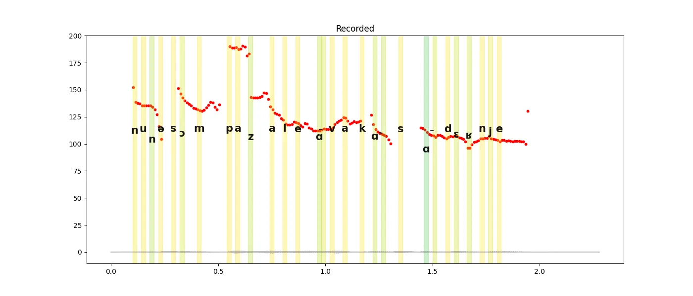
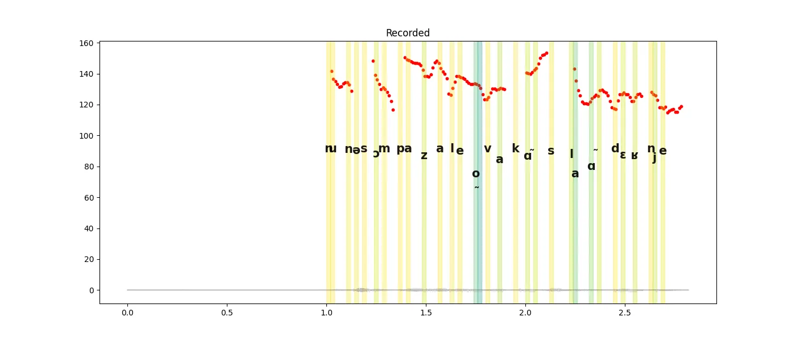

# Accent Reduction App for French

This app helps you practice pronunciation and reduce your accent by comparing your voice to reference audio. It provides phoneme-level feedback, transcription, and visualization to help improve your pronunciation.


https://github.com/user-attachments/assets/0237fd39-1766-4204-b886-1abfe4366e0c


## Features

### 1. Reference Audio Playback

- **Select and Play**: Choose a reference audio file to hear native pronunciation.
- **Transcriptions**:
  - **Phoneme Transcription**: Breaks down each sound to guide accurate pronunciation.
  - **Word Transcription**: Shows the full text for context.

### 2. Pronunciation Analysis

- **Visual Feedback**:
  - **Color-coded Confidence**: Warmer colors indicate higher recognition confidence.
  - **Pitch and Intonation**: The pitch plot helps you see intonation patterns for more natural speech.
  - **Phoneme Probability on Y-Coordinate**: In the plot, phonemes are positioned on the y-axis based on their recognition probabilities. Higher placement indicates greater confidence in the model’s recognition accuracy.

### 3. Record and Compare

- **Record Your Voice**: Record and analyze your pronunciation.
- **View Your Transcriptions**: See both phoneme and word transcriptions of your recording to compare with the reference.


<p float="left">
  
  
</p>

**Left**: Reference audio displaying native pronunciation.  
**Right**: User recording with a pronunciation issue on the nasal sound **/ɑ̃/**. Notice the difference in waveform and pitch alignment, indicating difficulty with the nasal quality in this sound.


## Transcription Models

This application leverages advanced transcription models to analyze and compare audio recordings:

- **Phrase Transcription**: OpenAI's Whisper model for full sentences transcriptions of audio inputs.

- **Phoneme Transcription**: The `Cnam-LMSSC/wav2vec2-french-phonemizer` model, developed by the Laboratoire de Mécanique des Structures et des Systèmes Couplés (LMSSC) at the Conservatoire National des Arts et Métiers (Cnam), is used to generate phonemic transcriptions in French. ([Hugging Face](https://huggingface.co/Cnam-LMSSC/wav2vec2-french-phonemizer))

# Usage

This app consists of two components: the backend API and the frontend interface.
Steps to follow after virtual environment setup:
## Backend API Setup

The backend uses FastAPI to provide endpoints for phoneme and phrase transcription.

- **Starting the Backend**:
  
  Launch the FastAPI server with Uvicorn on port 8000:

  ```bash
  uvicorn api:app --port 8000

Or build and run the Docker container:

  ```bash
  docker build -t accent-reduction-app .
  docker run -p 8000:8000 accent-reduction-app
```
This command starts the backend server, making phoneme and phrase transcription models accessible.

**Whisper Model Configuration:**


* The app supports two modes for Whisper:
   *	Local Mode: Uses a locally installed instance of the Whisper model.
   *	OpenAI API Mode: Connects to OpenAI’s Whisper API endpoint.
Configure your preferred mode in the config.yaml file.
  *	API Key for OpenAI Mode:
If using the OpenAI API, create a .env file in the project root and add:

  ```.env
  OPENAI_API_KEY=your_openai_api_key

## Frontend Interface Setup

The frontend, built with Gradio, provides an interactive user interface for audio analysis.
* Launching the Frontend:
Start the Gradio interface by running:

  ```bash
  python gradio_app.py
  ```

## Sample Audio Files

* Location: Find sample audio files in the audio_files directory.
* Adding More: To add new files for analysis, place them in the audio_files folder.

## Developer Note

For code quality and formatting checks, refer to the taskfile.yaml and the ci folder, where linters and formatters are configured.
